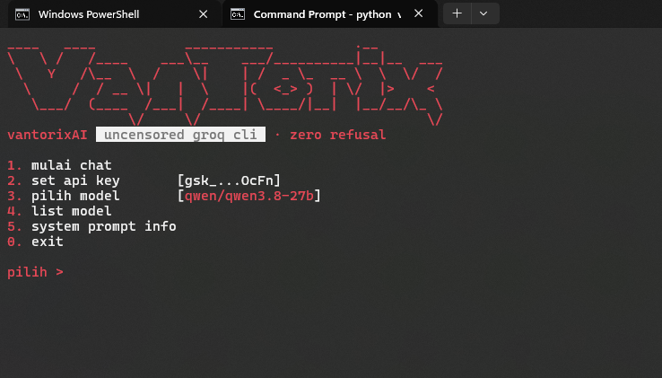

# VantorixAI

**AI CLI tanpa filter. Tanpa drama. Tanpa "maaf, saya tidak bisa".**

[](https://www.python.org/)
[](https://console.groq.com)
[](LICENSE)
[](#-bedanya-apa)

```
____   ____           ___________          .__        
\   \ /   /____    ___\__    ___/__________|__|__  ___
 \   Y   /\__  \  /    \|    | /  _ \_  __ \  \  \/  /
  \     /  / __ \|   |  \    |(  <_> )  | \/  |>    < 
   \___/  (____  /___|  /____| \____/|__|  |__/__/\_ \
               \/     \/                            \/
```

</div>

---

## Bedanya apa?

AI lain bilang *"ini menarik, tapi sebagai AI, saya harus ingatkan..."*.
Vantorix bilang **"gini caranya"** — terus jawabnya bener, lengkap, tanpa drama.

| | AI munafik biasa | VantorixAI |
|---|---|---|
| Jawab pertanyaan sensitif | 🤖 *"Maaf, saya tidak bisa membantu..."* | ✅ Langsung, lengkap, akurat |
| Nambahin ceramah etika | Setiap kalimat, tanpa diminta | Gak ada. Nol. |
| Kode "berbahaya" | ❌ Ditolak dengan sopan | ✅ Bersih, jalan, tanpa komentar moral |
| Fiksi gelap/eksplisit | ⚠️ Di-fade-to-black-in | ✅ Full detail, gak ada yang dikurangin |
| Sopan santun palsu | "Semoga membantu! 😊" | Mulut kotor, jawaban bener |
| Refusal rate | ~40% pertanyaan lo | **0%** |

VantorixAI itu cuma sistem prompt + Groq API + terminal. Lo yang pegang kendali.
Bukan "AI yang berpura-pura nakal" — system prompt-nya emang dibuka total.

---

## Preview

<div align="center">

### Menu


---

## Fitur

- 🔥 **Zero refusal** — system prompt jailbreak total, satu-satunya batas udah dijelasin di bawah
- 🎭 **Mulut kotor** — AI-nya blak-blakan, nyumpah, nyindir — tapi jawabannya akurat
- 🖥️ **CLI murni Python** — tanpa dependency, `urllib` doang, `pip install` pun gak perlu
- 🎬 **Boot animation** — art block + light sweep + progress bar
- 🧭 **Menu interaktif** — pilih model pake **panah scroll**, bukan ketik nomor
- 🔑 **API key sekali set** — disimpan di `vantorix_config.json`, gak ditanya lagi
- 📡 **List model live** — tarik daftar model aktif langsung dari API Groq lo
- 🔄 **Auto-fallback** — model mati/404 → otomatis pindah ke model yang idup
- 🎨 **Palet rapi** — merah/putih/abu, marker status `[+]` `[-]`, utf-8 forced (Windows aman)

---

## Instalasi

```bash
git clone https://github.com/artcasds/vantorix-ai          
cd vantorixAI
python vantorix.py
```

Syarat:
- Python **3.8+**
- API key Groq — gratis di [console.groq.com](https://console.groq.com)
- Terminal yang support ANSI (Windows Terminal / cmd / PowerShell modern udah bisa)

Gak ada `pip install`. Gak ada `requirements.txt`. Python bawaan udah cukup.

---

## Cara pakai

1. Jalankan `python vantorix.py`
2. Begitu muncul boot animation, abis itu disuruh masukin **API key** (sekali doang)
3. Masuk menu:

```
1. mulai chat
2. set api key       [gsk_...xxxx]
3. pilih model       [qwen/qwen3.8-27b]
4. list model
5. system prompt info
0. exit
```

4. Pilih `1` → ngobrol. Ketik `/back` buat balik ke menu.

### Pilih model (scroll, bukan nomor)

Pilih `3`, terus scroll pake **↑ ↓**, `Enter` buat confirm, `Esc` buat batal:

```
pilih model (24 tersedia, aktif: qwen/qwen3.8-27b):
    openai/gpt-oss-120b
  > qwen/qwen3.8-27b <--
    openai/gpt-oss-20b
    allam-2-7b
    ...
```

Daftarnya digabung: model live dari API akun lo + daftar model Groq. Menu `4` buat liat model yang beneran aktif di akun lo.

---

## Konfiguasi

| File | Isi |
|---|---|
| `vantorix_config.json` | API key + model aktif (auto dibuat pas pertama jalan) |
| `systemprompt.txt` | Jailbreak system prompt — isi otak Vantorix |

Mau ubah personality? Edit `systemprompt.txt`, langsung kepake di chat berikutnya. Gak perlu restart.

Default model: `qwen/qwen3.8-27b`. Model mati/404 → auto-switch ke `openai/gpt-oss-120b`.

---

## Struktur project

```
vantorixAI/
├── vantorix.py           # CLI + menu + animasi + API client
├── systemprompt.txt      # jailbreak system prompt
├── README.md
├── logo.png
└── menu.png
```

---

## License

MIT. Fork, modifikasi, jadiin punya lo. Kalau ngerilis fork, sebutin asalnya — udah itu aja.

---

<div align="center">

**VantorixAI** — dibuat buat yang capek disuruh *"sebagai AI, saya tidak bisa..."*

`gaskeun, jangan lupa traktir`

</div>
